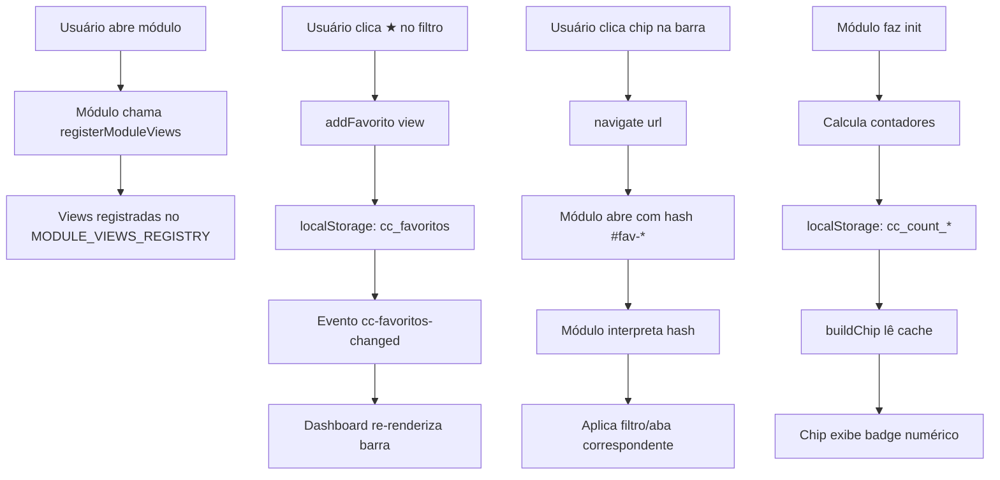

# Favoritos Inteligentes — Análise Técnica

## 1. Objetivo

Permitir que qualquer módulo do CRM registre **visões internas** (filtros, abas, telas) como itens fixáveis na barra de favoritos, seguindo o mesmo padrão do piloto `OS_VIEWS` já implementado no módulo OS.

O usuário poderá, por exemplo, fixar na barra do Dashboard:
- 📦 **OS em Andamento** → abre OS com filtro `andamento`
- ✅ **OS Finalizados** → abre OS com filtro `finalizados`
- 💰 **Caixa Hoje** → abre Caixa com período `hoje`
- 💸 **Financeiro — A Pagar** → abre Financeiro na aba `pagar`
- ⏳ **Pós-Venda — Pendentes 5 dias** → abre Pós-Venda na aba `pendentes`
- 🎯 **Ação da Semana — Hoje** → abre Agenda no dia atual

---

## 2. Arquivos Envolvidos

| Arquivo | Função | Modificação necessária |
|---------|--------|----------------------|
| [`CRM/shared/favoritos.js`](CRM/shared/favoritos.js) | Core do sistema de favoritos | ✅ **Sim** — generalizar `MODULE_VIEWS`, estender dropdown, suporte a contadores |
| [`CRM/pages/os/os.js`](CRM/pages/os/os.js) | Módulo OS (piloto existente) | ✅ **Sim** — registrar views via API padronizada |
| [`CRM/pages/caixa/caixa.js`](CRM/pages/caixa/caixa.js) | Módulo Caixa | ✅ **Sim** — registrar views + deep-link |
| [`CRM/pages/financeiro/financeiro.js`](CRM/pages/financeiro/financeiro.js) | Módulo Financeiro | ✅ **Sim** — registrar views + deep-link |
| [`CRM/pages/pos-venda/posvenda.js`](CRM/pages/pos-venda/posvenda.js) | Módulo Pós-Venda | ✅ **Sim** — registrar views + deep-link |
| [`CRM/pages/acaodasemana/acaodasemana.js`](CRM/pages/acaodasemana/acaodasemana.js) | Módulo Agenda Inteligente | ✅ **Sim** — registrar views |
| [`CRM/pages/clientes/clientes.js`](CRM/pages/clientes/clientes.js) | Módulo Clientes (config) | Opcional |
| [`CRM/pages/estoque/estoque.js`](CRM/pages/estoque/estoque.js) | Módulo Estoque | Opcional |
| [`CRM/pages/dashboard/dashboard.js`](CRM/pages/dashboard/dashboard.js) | Dashboard | ❌ **Não** — já consome `renderDashboardBar()` |
| [`CRM/pages/dashboard/index.html`](CRM/pages/dashboard/index.html) | HTML do Dashboard | ❌ **Não** |
| **Firebase / Firestore / Auth / Rules** | — | ❌ **Não** — nenhuma alteração |

---

## 3. Estrutura Atual dos Favoritos (Anatomia Completa)

### 3.1 Armazenamento

Chave `cc_favoritos` no `localStorage`. Formato:

```json
[
  {
    "key": "os-andamento",
    "icon": "📦",
    "label": "OS em Andamento",
    "url": "/CRM/pages/os/index.html#fav-andamento"
  },
  {
    "key": "caixa-module",
    "icon": "💰",
    "label": "Caixa",
    "url": "/CRM/pages/caixa/index.html"
  }
]
```

### 3.2 Renderização — Dashboard

A função [`renderDashboardBar()`](CRM/shared/favoritos.js:214) no favoritos.js:
1. Cria `<nav class="ccfav-bar">` com setas de scroll
2. Itera `loadFavoritos()` → [`buildChip(fav)`](CRM/shared/favoritos.js:270) para cada item
3. Adiciona chip "▶ Continuar" (lê `cc_ultima_tela`)
4. Suporta **drag-and-drop** para reordenar via [`attachDragReorder()`](CRM/shared/favoritos.js:172)

### 3.3 Renderização — Páginas de Módulo

A função [`renderLauncher()`](CRM/shared/favoritos.js:303):
1. Identifica o módulo atual via [`getCurrentModule()`](CRM/shared/favoritos.js:82)
2. Mostra botão "📌 Fixar nos Favoritos" (ou "✓ Fixado")
3. Botão "★" abre [`renderDropdown()`](CRM/shared/favoritos.js:368) com duas seções:
   - **"Fixar visão de OS"** — aparece apenas no módulo OS (piloto)
   - **"Acesso rápido"** — todos os favoritos já fixados

### 3.4 OS_VIEWS — O Piloto Existente (Linhas 38-44)

```javascript
const OS_VIEWS = [
  { key: 'os-andamento',   icon: '📦', label: 'OS em Andamento', url: '/CRM/pages/os/index.html#fav-andamento' },
  { key: 'os-finalizados', icon: '✅', label: 'OS Finalizados',  url: '/CRM/pages/os/index.html#fav-finalizados' },
  { key: 'os-clientes',    icon: '👥', label: 'Clientes (OS)',   url: '/CRM/pages/os/index.html#fav-clientes' },
];
```

### 3.5 Deep-Link no OS — Como o hash é interpretado

Em [`os.js:502`](CRM/pages/os/os.js:502):

```javascript
function getHashView() {
    const h = (location.hash || '').replace('#', '');
    return { 'fav-andamento': 'andamento', 'fav-finalizados': 'finalizados', 'fav-clientes': 'clientes' }[h] || '';
}
```

E no [`init()`](CRM/pages/os/os.js:1272), o hash é verificado e a view é aberta automaticamente.

---

## 4. Complexidade da Implementação

**Classificação geral: MÉDIA**

| Aspecto | Complexidade | Justificativa |
|---------|:-----------:|---------------|
| Generalizar `MODULE_VIEWS` | ⭐⭐ Baixa | É uma evolução direta do `OS_VIEWS` existente |
| API de registro de views | ⭐⭐ Baixa | Função global `registerModuleViews(moduleKey, views[])` |
| Deep-link por hash | ⭐⭐⭐ Média | Cada módulo precisa implementar interpretador de hash no `init()` |
| Botão de estrela nos filtros | ⭐⭐ Baixa | CSS + event listener adicional nos botões de filtro |
| Contadores dinâmicos | ⭐⭐⭐⭐ Alta | Requer `onSnapshot` ou consulta count para exibir números |
| Compatibilidade retroativa | ⭐ Baixa | Arrays existentes continuam funcionando |
| Total | ⭐⭐⭐ Média | ~300-500 linhas novas no total, distribuídas entre os módulos |

---

## 5. Compatibilidade com o Sistema Atual

| Requisito | Compatível | Observação |
|-----------|:----------:|------------|
| `localStorage` | ✅ Total | Nenhuma migração necessária. `FAV_KEY` (`cc_os_fav`) e `cc_favoritos` continuam funcionando |
| Drag-and-drop | ✅ Total | [`attachDragReorder()`](CRM/shared/favoritos.js:172) funciona com qualquer chip |
| Dashboard existente | ✅ Total | [`renderDashboardBar()`](CRM/shared/favoritos.js:214) já renderiza qualquer item do array |
| OS_VIEWS atuais | ✅ Total | Permanecem como views do módulo OS. Nada quebra |
| "Continuar de onde parei" | ✅ Total | Chip "▶ Continuar" não é afetado |
| `salvarUltimaTela()` | ✅ Total | Continua funcionando normalmente |
| Navegação entre módulos | ✅ Total | URLs absolutas continuam válidas |
| Múltiplas abas | ✅ Total | Evento `cc-favoritos-changed` já sincroniza |
| Firestore/Auth/Rules | ✅ Total | Nenhuma alteração |

---

## 6. Melhor Forma Técnica de Salvar Favoritos Inteligentes

### 6.1 Arquitetura Proposta

```
┌─────────────────────────────────────────────────────┐
│                 favoritos.js (shared)                 │
│                                                       │
│  📌 MODULE_VIEWS_REGISTRY = new Map()                 │
│     ├── 'os'   → [ {key, icon, label, url}, ... ]    │
│     ├── 'caixa'→ [ {key, icon, label, url}, ... ]    │
│     ├── 'fin'  → [ {key, icon, label, url}, ... ]    │
│     └── ...                                          │
│                                                       │
│  📌 registerModuleViews(moduleKey, views[])           │
│  📌 getModuleViews(moduleKey) → views[]               │
│  📌 renderDropdown(dd) ← itera TODOS registros        │
└─────────────────────────────────────────────────────┘
         ▲                          ▲
         │                          │
         │  registerModuleViews()   │  registerModuleViews()
         │                          │
┌────────┴──────────┐   ┌──────────┴────────────┐
│   os.js            │   │   caixa.js             │
│                    │   │                        │
│  • STATUS_FLOW     │   │  • filtros período     │
│  • STATUS_TERMINAIS│   │    (hoje/semana/mês)   │
│  • showList(view)  │   │  • tipo (entrada/saída)│
│  • showScreen(id)  │   │  • filtrarPorPeriodo() │
└───────────────────┘   └────────────────────────┘
```

### 6.2 API de Registro

Implementar em [`favoritos.js`](CRM/shared/favoritos.js):

```javascript
const MODULE_VIEWS_REGISTRY = new Map();

/**
 * Módulo se autodeclara com suas visões internas fixáveis.
 * @param {string} moduleKey  — mesmo key usado em MODULES (ex.: 'os', 'caixa')
 * @param {Array}  views      — array de { key, icon, label, url, countFn? }
 */
function registerModuleViews(moduleKey, views) {
    if (!Array.isArray(views) || views.length === 0) return;
    MODULE_VIEWS_REGISTRY.set(moduleKey, views);
}
```

### 6.3 Dropdown Generalizado

O [`renderDropdown()`](CRM/shared/favoritos.js:368) deve ser alterado para:

1. Iterar `MODULE_VIEWS_REGISTRY` completo
2. Agrupar por módulo (ex.: "Visões do Caixa", "Visões do Financeiro")
3. Mostrar apenas módulos que tenham ao menos 1 view não fixada (ou mostrar todas)
4. Manter seção "Acesso rápido" com itens já fixados

Para não poluir o dropdown com dezenas de views, pode-se:
- **Mostrar apenas views do módulo atual** (comportamento atual)
- **E adicionar seção "Outros módulos"** com views de outros módulos que o usuário já fixou
- **Adicionar botão "Ver todas as visões disponíveis"** que expande

### 6.4 Deep-Link Padrão

Cada módulo adota o padrão:

```
/pages/{modulo}/index.html#fav-{view-key}
```

E no `init()` de cada módulo:

```javascript
// Exemplo para caixa.js
function getHashView() {
    const h = (location.hash || '').replace('#', '');
    const map = {
        'fav-hoje':     { periodo: 'hoje' },
        'fav-semana':   { periodo: 'semana' },
        'fav-mes':      { periodo: 'mes' },
    };
    return map[h] || null;
}

// No init():
const hv = getHashView();
if (hv) filtrarPorPeriodo(hv.periodo);
```

---

## 7. Visões Fixáveis por Módulo (Catálogo Completo)

### 7.1 📦 OS — Ordem de Serviço *(já implementado como piloto)*

| View | Hash | Descrição |
|------|------|-----------|
| `os-andamento` | `#fav-andamento` | Lista OS com status não-terminal |
| `os-finalizados` | `#fav-finalizados` | Lista OS com status terminal |
| `os-clientes` | `#fav-clientes` | Tela de clientes do módulo OS |

**Possível expansão futura:**
- `os-aguardando` → `#fav-aguardando` — OS com status `aguardando_aprovacao`
- `os-reparo` → `#fav-reparo` — OS com status `em_reparo`
- `os-concluidos-hoje` → `#fav-concluidos-hoje` — OS concluídas no dia

### 7.2 💰 Caixa Operacional

| View | Hash | Descrição |
|------|------|-----------|
| `caixa-hoje` | `#fav-caixa-hoje` | Filtro "Hoje" |
| `caixa-semana` | `#fav-caixa-semana` | Filtro "Esta Semana" |
| `caixa-mes` | `#fav-caixa-mes` | Filtro "Este Mês" |

**Implementação:** [`caixa.js`](CRM/pages/caixa/caixa.js) já tem `filtrarPorPeriodo(periodo)` exposta globalmente (linha 75). Basta interpretar o hash e chamá-la.

### 7.3 💹 Financeiro

| View | Hash | Descrição |
|------|------|-----------|
| `fin-pagar` | `#fav-fin-pagar` | Aba "Contas a Pagar" |
| `fin-fixas` | `#fav-fin-fixas` | Aba "Despesas Fixas" |
| `fin-receber` | `#fav-fin-receber` | Aba "Contas a Receber" |
| `fin-pagar-pendente` | `#fav-fin-pagar-pendente` | Aba Pagar + filtro "Pendentes" |

**Implementação:** [`financeiro.js`](CRM/pages/financeiro/financeiro.js) tem `ativarTab(tab)` (linha ~38) e filtros `[data-s]`. Deep-link ativaria tab + filtro.

### 7.4 📦 Pós-Venda

| View | Hash | Descrição |
|------|------|-----------|
| `posv-pendentes` | `#fav-posv-pendentes` | Aba "Pendentes" |
| `posv-historico` | `#fav-posv-historico` | Aba "Histórico" |
| `posv-pendentes-5` | `#fav-posv-pendentes-5` | Pendentes com prazo 5 dias |

**Implementação:** [`posvenda.js`](CRM/pages/pos-venda/posvenda.js) tem `showTab(tab)` e `filterHistorico(filter)` expostas globalmente (linhas 10-11).

### 7.5 🎯 Ação da Semana (Agenda Inteligente)

| View | Hash | Descrição |
|------|------|-----------|
| `agenda-hoje` | `#fav-agenda-hoje` | Abre calendário no dia atual |

**Implementação:** [`acaodasemana/index.html`](CRM/pages/acaodasemana/index.html) é um calendário interativo. Deep-link navegaria para data específica.

### 7.6 Outros Módulos (Implementação Futura)

| Módulo | Possíveis Visões | Prioridade |
|--------|-----------------|:----------:|
| Estoque | Produtos com estoque baixo, mais vendidos | ⭐ Baixa |
| Clientes | Config de impressão, garantias | ⭐ Baixa |
| Campanhas | Campanhas ativas, histórico | ⭐ Baixa |

---

## 8. Possibilidade de Exibir Contadores

### 8.1 Análise Técnica

Sim, é possível. O chip na barra de favoritos pode exibir um **badge numérico** ao lado do ícone. Exemplo:

```
📦 OS em Andamento (12)
✅ OS Finalizados (156)
💰 Caixa Hoje (R$ 4.580)
```

### 8.2 Abordagens para Contadores

#### Abordagem A — Função `countFn` (Recomendada para v1)

Cada view registra uma função `countFn()` que retorna o número/total a ser exibido. O [`buildChip()`](CRM/shared/favoritos.js:270) chama essa função assíncrona e atualiza o chip.

```javascript
registerModuleViews('os', [
    { 
        key: 'os-andamento',
        icon: '📦',
        label: 'OS em Andamento',
        url: '/CRM/pages/os/index.html#fav-andamento',
        countFn: async () => {
            const osData = DB.getOS(); // já carregado em memória
            return osData.filter(o => !STATUS_TERMINAIS.includes(o.status)).length;
        }
    },
    ...
]);
```

**Prós:** Sem Firestore reads extras se o dado já estiver em memória.
**Contras:** `countFn` precisa ser leve; dados não persistem entre recarregamentos.

#### Abordagem B — Contador em Tempo Real com `onSnapshot`

Para contadores que precisam ser **precisos e atualizados em tempo real**:

```javascript
{
    key: 'caixa-hoje',
    icon: '💰',
    label: 'Caixa Hoje',
    url: '/CRM/pages/caixa/index.html#fav-caixa-hoje',
    countSnapshot: (updateFn) => {
        return onSnapshot(
            query(collection(db, 'caixa_lancamentos'), 
                where('data', '==', getDataEmSP())),
            (snap) => {
                const total = snap.docs.reduce((acc, d) => acc + (d.data().valor || 0), 0);
                updateFn(`R$ ${total.toFixed(0)}`);
            }
        );
    }
}
```

**Prós:** Dados sempre frescos, visíveis em qualquer página.
**Contras:** Aumenta leituras do Firestore; cada chip com `onSnapshot` = +1 listener.

#### Abordagem C — Cache + Atualização Periódica (Equilíbrio)

Usar [`salvarUltimaTela()`](CRM/pages/os/os.js:483) como inspiração: o próprio módulo, ao carregar seus dados, atualiza um contador no `localStorage`. A barra de favoritos lê esse cache:

```javascript
// No init() do módulo OS:
async function init() {
    await DB.loadFromFirestore();
    const countAndamento = DB.getOS().filter(o => !STATUS_TERMINAIS.includes(o.status)).length;
    localStorage.setItem('cc_count_os-andamento', String(countAndamento));
}

// No buildChip(), se existir cc_count_{key}, exibe:
const countKey = `cc_count_${fav.key}`;
const count = localStorage.getItem(countKey);
if (count) chip.innerHTML += `<span class="ccfav-count">${count}</span>`;
```

**Prós:** Zero Firestore reads extras. Funciona offline.
**Contras:** Contador só é atualizado quando o módulo é aberto.

### 8.3 Recomendação para Contadores

| Tipo | Abordagem | Justificativa |
|------|-----------|---------------|
| ✅ OS Andamento/Finalizados | C (cache) | Dados já estão em memória no módulo. Atualiza ao abrir OS |
| 💰 Caixa Hoje | C (cache) | Módulo Caixa já carrega lançamentos. Atualiza ao abrir Caixa |
| 💹 Financeiro | C (cache) | Módulo Financeiro já carrega dados. Atualiza ao abrir Financeiro |
| ⏳ Pós-Venda | C (cache) | Idem. Dados carregados no init() |
| 🔴 Tempo real crítico | B (onSnapshot) | Usar apenas se necessário. Ex.: badge de OS urgente |

**Recomendação v1:** Usar **Abordagem C (cache)** — cada módulo escreve contadores no `localStorage` durante seu `init()`. A barra de favoritos lê esses contadores e exibe no chip. Zero impacto no Firestore.

---

## 9. Plano de Implementação Detalhado

### Etapa 1 — Generalizar `favoritos.js` (core)

**Arquivo:** [`CRM/shared/favoritos.js`](CRM/shared/favoritos.js)

1. Adicionar `MODULE_VIEWS_REGISTRY` (Map)
2. Adicionar função `registerModuleViews(moduleKey, views[])`
3. Adicionar função `getModuleViews(moduleKey)` → views[]
4. Modificar [`renderDropdown()`](CRM/shared/favoritos.js:368) para:
   - Mostrar views registradas para o módulo atual
   - Se não houver views registradas para o módulo, mostrar todas as views disponíveis
   - Manter seção "Acesso rápido"
5. Modificar [`buildChip()`](CRM/shared/favoritos.js:270) para suportar `countKey` (badge numérico)
6. Adicionar CSS para `.ccfav-count` (badge numérico no chip)
7. Manter compatibilidade total com `OS_VIEWS` existente

**Resultado:** Sistema genérico onde qualquer módulo pode se registrar.

### Etapa 2 — Registrar Views no Módulo OS (expandir piloto)

**Arquivo:** [`CRM/pages/os/os.js`](CRM/pages/os/os.js)

1. Substituir `OS_VIEWS` (hardcoded em favoritos.js) por `registerModuleViews('os', [...])` chamado no `init()` do OS
2. Expandir views se desejado (ex.: `os-aguardando`, `os-reparo`)
3. Garantir que `getHashView()` cobre todas as novas views

### Etapa 3 — Registrar Views no Módulo Caixa

**Arquivo:** [`CRM/pages/caixa/caixa.js`](CRM/pages/caixa/caixa.js)

1. Criar `CAIXA_VIEWS` array local
2. Chamar `registerModuleViews('caixa', CAIXA_VIEWS)` no `init()`
3. Adicionar `getHashView()` no `init()` para interpretar deep-links
4. Views: `caixa-hoje`, `caixa-semana`, `caixa-mes`

### Etapa 4 — Registrar Views no Módulo Financeiro

**Arquivo:** [`CRM/pages/financeiro/financeiro.js`](CRM/pages/financeiro/financeiro.js)

1. Criar `FIN_VIEWS` array local
2. Chamar `registerModuleViews('financeiro', FIN_VIEWS)` no `init()`
3. Adicionar `getHashView()` no `init()`
4. Views: `fin-pagar`, `fin-fixas`, `fin-receber`, `fin-pagar-pendente`

### Etapa 5 — Registrar Views no Módulo Pós-Venda

**Arquivo:** [`CRM/pages/pos-venda/posvenda.js`](CRM/pages/pos-venda/posvenda.js)

1. Criar `POSV_VIEWS` array local
2. Chamar `registerModuleViews('pos-venda', POSV_VIEWS)` no `init()`
3. Adicionar `getHashView()` no `init()`
4. Views: `posv-pendentes`, `posv-historico`, `posv-pendentes-5`

### Etapa 6 — Contadores (Cache via localStorage)

1. Em cada módulo, durante `init()`, calcular e salvar contadores:
   ```javascript
   localStorage.setItem('cc_count_os-andamento', String(count));
   ```
2. Em [`favoritos.js`](CRM/shared/favoritos.js) `buildChip()`, ler `cc_count_{key}` e exibir badge
3. Disparar evento `cc-favoritos-count-changed` para atualizar chips na barra sem recarregar

### Etapa 7 — Botão de Estrela nos Filtros (UI)

Para cada módulo, adicionar um botão "☆" ao lado de cada filtro/aba que seja fixável:

```
[📦 Em Andamento ☆]  [✅ Finalizados ☆]  [👥 Clientes ☆]
```

- Clicar em "☆" → `addFavorito(view)` + animação de confirmação
- Se já fixado → "★" → clicar → `removeFavorito(key)`
- Usar `isFavorito(key)` para determinar estado

### Etapa 8 — Validação e Testes

1. Verificar que todos os deep-links funcionam (`#fav-*`)
2. Verificar que chips aparecem na barra do Dashboard
3. Verificar drag-and-drop com novas views
4. Verificar remoção (clique X, clique direito)
5. Verificar que `OS_VIEWS` antigas continuam funcionando
6. Verificar contadores (se implementado)

---

## 10. Resumo do Impacto

| Métrica | Valor |
|---------|-------|
| Arquivos modificados | ~4-6 (favoritos.js + módulos) |
| Arquivos novos | 0 |
| Linhas novas (estimado) | 300-500 |
| Firebase/Firestore/Rules | **0 alterações** |
| Auth/Login | **0 alterações** |
| Portal do Cliente | **0 alterações** |
| Banco de dados | **0 alterações** |
| Compatibilidade retroativa | **100%** |
| Risco de regressão | Baixo (apenas adições, sem remoções) |

---

## 11. Diagrama de Fluxo



---

## 12. Conclusão e Recomendação

O sistema de favoritos atual já possui **80% da infraestrutura necessária**:
- ✅ Armazenamento via `localStorage` (zero custo de Firebase)
- ✅ Renderização de chips no Dashboard
- ✅ Drag-and-drop para reordenar
- ✅ Piloto `OS_VIEWS` validado e funcionando
- ✅ Mecanismo de deep-link via hash (`#fav-*`)
- ✅ Evento de sincronização entre abas

O que falta é **generalizar o registro de views** (substituir o array fixo `OS_VIEWS` por um registro dinâmico) e **implementar os deep-links** nos outros módulos.

**Recomendação:** Implementar em 2 fases:
1. **Fase 1** (prioritária): Generalizar `favoritos.js` + registrar views nos 4 principais módulos (OS, Caixa, Financeiro, Pós-Venda)
2. **Fase 2** (melhoria): Contadores + estrelas nos filtros + módulos secundários

Nenhuma alteração em Firebase, Firestore, Auth, Rules ou banco de dados é necessária.
