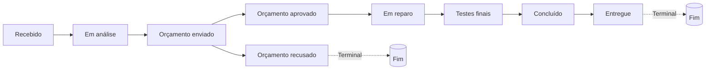

# Plano de Implementação — 3 Melhorias no Módulo de OS

## Sumário

1. [Visão Geral](#1-visão-geral)
2. [Arquivos Envolvidos](#2-arquivos-envolvidos)
3. [Fluxo de Status — Diagrama](#3-fluxo-de-status--diagrama)
4. [MELHORIA 1 — Campo de Valor do Orçamento](#4-melhoria-1--campo-de-valor-do-orçamento)
5. [MELHORIA 2 — Novos Status de Orçamento](#5-melhoria-2--novos-status-de-orçamento)
6. [MELHORIA 3 — Garantia Vinculada à OS](#6-melhoria-3--garantia-vinculada-à-os)
7. [Ordem de Implementação](#7-ordem-de-implementação)
8. [Testes e Validação](#8-testes-e-validação)

---

## 1. Visão Geral

Três melhorias autorizadas para implementação automática no módulo de OS, sem necessidade de aprovações intermediárias. O fluxo será:

```
Backup → Implementação (M1 → M2 → M3) → Testes → Validação → Relatório
```

---

## 2. Arquivos Envolvidos

| Arquivo | M1 | M2 | M3 |
|---------|---|---|---|
| [`CRM/pages/os/os.js`](../CRM/pages/os/os.js) | ✅ Linhas 430-470, 591-609 | ✅ Linhas 379-397, 542-580, 613, 641 | ✅ Linhas 430-470, 542-580, 591-609, 652-735 |
| [`CRM/pages/os/os.css`](../CRM/pages/os/os.css) | — | ✅ Linhas 211-221 | — |
| [`CRM/pages/os/index.html`](../CRM/pages/os/index.html) | ✅ Linha 100 | — | ✅ Linhas 98-103 |
| [`CRM/pages/portal-cliente/portal.js`](../CRM/pages/portal-cliente/portal.js) | ✅ Linha 787 | ✅ Linhas 7-23, 704-723, 806-819, 844-884 | ✅ Linhas 773-778, 957-992 |
| [`CRM/pages/dashboard/dashboard.js`](../CRM/pages/dashboard/dashboard.js) | — | ✅ Linhas 773-784, 786-799 | — |
| [`CRM/shared/favoritos.js`](../CRM/shared/favoritos.js) | — | — | — |

---

## 3. Fluxo de Status — Diagrama



**Legenda:**
- `orcamento_recusado` é terminal (não retorna ao fluxo automaticamente)
- `entregue` é terminal
- Compatibilidade retroativa mantida via `STATUS_LEGACY`

---

## 4. MELHORIA 1 — Campo de Valor do Orçamento

### Situação Atual
- O campo `f-valor` já existe no formulário (linha 100 do [`CRM/pages/os/index.html`](../CRM/pages/os/index.html)) com label `Valor (R$)`
- O valor já é salvo como `valor` no Firestore (linha 442 do [`CRM/pages/os/os.js`](../CRM/pages/os/os.js))
- Já é exibido no detail (linha 548) e no portal (linha 787)

### O que precisa mudar

#### a) Renomear campo no formulário de criação
- **Arquivo:** [`CRM/pages/os/index.html`](../CRM/pages/os/index.html) — linha 100
- **Atual:** `<label>Valor (R$) <span class="optional">(opcional)</span></label>`
- **Novo:** `<label>Valor do Orçamento (à vista / PIX) <span class="optional">(opcional)</span></label>`

#### b) Renomear campo no formulário de edição
- **Arquivo:** [`CRM/pages/os/os.js`](../CRM/pages/os/os.js) — função `toggleOSEdit()` (linha 582)
- Verificar label atual do `edit-os-valor` e renomear para "Valor do Orçamento (à vista / PIX)"

#### c) Adicionar preparação para "Valor Cartão" (campo oculto/comentado)
- **Arquivo:** [`CRM/pages/os/index.html`](../CRM/pages/os/index.html)
- Adicionar campo `f-valor-cartao` como hidden/commented, com label "Valor Cartão (opcional)"
- **Arquivo:** [`CRM/pages/os/os.js`](../CRM/pages/os/os.js) — `saveOS()` (linha 433)
- Adicionar parse de `f-valor-cartao` e salvar como `valorCartao` no Firestore doc
- **Arquivo:** [`CRM/pages/os/os.js`](../CRM/pages/os/os.js) — `saveOSEdit()` (linha 598)
- Adicionar campo `valorCartao` nos updates

#### d) Exibir "Valor Cartão" no detail e portal (quando preenchido)
- **Arquivo:** [`CRM/pages/os/os.js`](../CRM/pages/os/os.js) — `renderDetail()` (linha 548)
- Adicionar exibição condicional de `valorCartao`
- **Arquivo:** [`CRM/pages/portal-cliente/portal.js`](../CRM/pages/portal-cliente/portal.js) — `renderOSDetalhe()` (linha 787)
- Adicionar exibição condicional de `valorCartao`

---

## 5. MELHORIA 2 — Novos Status de Orçamento

### 5.1 `STATUS_FLOW` — [`CRM/pages/os/os.js`](../CRM/pages/os/os.js) — linhas 379-388

**Atual:**
```javascript
{ key: 'aguardando_aprovacao', label: 'Aguardando aprovação', color: 'var(--yellow)' },
{ key: 'aprovado',             label: 'Aprovado',             color: 'var(--orange)' },
```

**Novo:**
```javascript
{ key: 'orcamento_enviado',    label: 'Orçamento enviado',    color: 'var(--yellow)' },
{ key: 'orcamento_aprovado',   label: 'Orçamento aprovado',   color: 'var(--green)' },
{ key: 'orcamento_recusado',   label: 'Orçamento recusado',   color: 'var(--red)' },
```

**Observação:** `orcamento_recusado` DEVE ser adicionado APÓS `orcamento_aprovado` no array `STATUS_FLOW`, para aparecer no seletor de status. Mas ele NÃO faz parte do fluxo principal — é um status lateral/terminal.

### 5.2 `STATUS_LEGACY` — [`CRM/pages/os/os.js`](../CRM/pages/os/os.js) — linhas 390-395

**Atual:**
```javascript
const STATUS_LEGACY = {
    'orcamento': 'aguardando_aprovacao',
    'pronto': 'concluido',
    'aguardando_peca': 'em_reparo'
};
```

**Novo:**
```javascript
const STATUS_LEGACY = {
    'orcamento': 'orcamento_enviado',
    'pronto': 'concluido',
    'aguardando_peca': 'em_reparo',
    'aguardando_aprovacao': 'orcamento_enviado',
    'aprovado': 'orcamento_aprovado',
    'devolvido_orcamento': 'orcamento_recusado'
};
```

### 5.3 `STATUS_TERMINAIS` — [`CRM/pages/os/os.js`](../CRM/pages/os/os.js) — linha 397

**Atual:** `['entregue', 'devolvido_orcamento']`

**Novo:** `['entregue', 'orcamento_recusado', 'devolvido_orcamento']`

### 5.4 `renderDetail()` — [`CRM/pages/os/os.js`](../CRM/pages/os/os.js) — linha 575

**Atual:** `const aguardandoAprov = os.status === 'aguardando_aprovacao' || os.status === 'orcamento';`

**Novo:** `const aguardandoAprov = os.status === 'orcamento_enviado' || os.status === 'orcamento' || os.status === 'aguardando_aprovacao';`

### 5.5 `markOrcamentoDevolvido()` — [`CRM/pages/os/os.js`](../CRM/pages/os/os.js) — linha 641

Sem alteração — esta função define `devolvido_orcamento` que continua existindo como status de "devolução física do aparelho".

### 5.6 CSS — [`CRM/pages/os/os.css`](../CRM/pages/os/os.css) — linhas 211-221

**Adicionar:**
```css
.status-orcamento_enviado { background: rgba(245,158,11,0.15); color: #fbbf24; }
.status-orcamento_aprovado { background: rgba(16,185,129,0.15); color: #34d399; }
.status-orcamento_recusado { background: rgba(239,68,68,0.15); color: #ef4444; }
```

**Remover (após verificar que não há mais referências):**
```css
.status-aguardando_aprovacao { ... }
.status-aprovado { ... }
```
(Melhor manter por compatibilidade com OS antigas no banco — apenas ADICIONAR as novas)

### 5.7 Portal — [`CRM/pages/portal-cliente/portal.js`](../CRM/pages/portal-cliente/portal.js)

#### a) `STATUS_LABEL` (linhas 7-23)

**Substituir:**
```javascript
'aguardando_aprovacao': { label: 'Aguardando Aprovação', cor: '#FFA726', icon: '📋' },
'aprovado':             { label: 'Aprovado',             cor: '#FF6D00', icon: '👍' },
```

**Por:**
```javascript
'orcamento_enviado':    { label: 'Orçamento Enviado',    cor: '#FFA726', icon: '📋' },
'orcamento_aprovado':   { label: 'Orçamento Aprovado',   cor: '#00C853', icon: '✅' },
'orcamento_recusado':   { label: 'Orçamento Recusado',   cor: '#EF5350', icon: '❌' },
```

**Adicionar em compatibilidade:**
```javascript
'aguardando_aprovacao': { label: 'Orçamento Enviado',    cor: '#FFA726', icon: '📋' },
'aprovado':             { label: 'Orçamento Aprovado',   cor: '#00C853', icon: '✅' },
```

#### b) `STATUS_ORDER` (linha 704)

**Atual:** `['recebido','em_analise','aguardando_aprovacao','aprovado','em_reparo','testes_finais','concluido','entregue']`

**Novo:** `['recebido','em_analise','orcamento_enviado','orcamento_aprovado','em_reparo','testes_finais','concluido','entregue']`

#### c) `_normStatus()` (linhas 707-713)

**Atual:** `orcamento: 'aguardando_aprovacao'`

**Novo:** `orcamento: 'orcamento_enviado', aguardando_aprovacao: 'orcamento_enviado', aprovado: 'orcamento_aprovado'`

#### d) `_statusProgress()` — `LABELS` array (linha 718)

**Atual:** `['Recebida','Em análise','Aguardando aprovação','Aprovado','Em reparo','Testes finais','Concluída','Entregue']`

**Novo:** `['Recebida','Em análise','Orçamento enviado','Orçamento aprovado','Em reparo','Testes finais','Concluída','Entregue']`

#### e) `renderOSDetalhe()` — card de orçamento (linha 806)

**Atual:** `if (o.status === 'aguardando_aprovacao' || o.status === 'orcamento')`

**Novo:** `if (o.status === 'orcamento_enviado' || o.status === 'aguardando_aprovacao' || o.status === 'orcamento')`

#### f) `aprovarOrcamento()` (linha 851)

**Atual:** `status: 'aprovado'`

**Novo:** `status: 'orcamento_aprovado'`

#### g) `recusarOrcamento()` (linha 872)

**Atual:** `status: 'devolvido_orcamento'`

**Novo:** `status: 'orcamento_recusado'`

### 5.8 Dashboard — [`CRM/pages/dashboard/dashboard.js`](../CRM/pages/dashboard/dashboard.js) — linhas 773-784

**Atual:** `if (os.status === 'aguardando_aprovacao' || os.status === 'orcamento')`

**Novo:**
```javascript
if (os.status === 'orcamento_enviado' || os.status === 'aguardando_aprovacao' || os.status === 'orcamento') {
```

---

## 6. MELHORIA 3 — Garantia Vinculada à OS

### 6.1 Estrutura de Garantias (já existente)

As garantias são configuradas em [`CRM/pages/clientes/clientes.js`](../CRM/pages/clientes/clientes.js) e armazenadas no Firestore em `config/impressao.garantias[]`.

Cada garantia tem:
```javascript
{ id: 'geral_90', nome: 'Garantia Geral 90 dias', texto: '...', padrao: true }
```

São carregadas em `localStorage.getItem('cc_config_impressao')`.

### 6.2 OS — Formulário de Criação

**Arquivo:** [`CRM/pages/os/index.html`](../CRM/pages/os/index.html) — entre linhas 98-103

**Adicionar após o campo `f-garantia` (prazo em dias):**
```html
<div class="form-group">
    <label>Modelo de Garantia <span class="optional">(opcional)</span></label>
    <select id="f-garantia-modelo">
        <option value="">Usar padrão do sistema</option>
    </select>
</div>
```

### 6.3 OS — `saveOS()` ([`CRM/pages/os/os.js`](../CRM/pages/os/os.js) — linhas 430-470)

**Adicionar após linha 434:**
```javascript
const garantiaModelo = document.getElementById('f-garantia-modelo');
const garantiaKey = garantiaModelo?.value || '';
let garantiaNome = '', garantiaTexto = '';
if (garantiaKey) {
    try {
        const cfg = JSON.parse(localStorage.getItem('cc_config_impressao') || '{}');
        const garantias = Array.isArray(cfg.garantias) ? cfg.garantias : [];
        const g = garantias.find(x => x.id === garantiaKey);
        if (g) { garantiaNome = g.nome; garantiaTexto = g.texto; }
    } catch {}
}
```

**Adicionar ao objeto `os` (linha 441-446):**
```javascript
garantiaKey, garantiaNome, garantiaTexto,
```

### 6.4 OS — `saveOSEdit()` ([`CRM/pages/os/os.js`](../CRM/pages/os/os.js) — linhas 591-609)

Adicionar campos `garantiaKey`, `garantiaNome`, `garantiaTexto` aos updates.

### 6.5 OS — `renderDetail()` ([`CRM/pages/os/os.js`](../CRM/pages/os/os.js) — linha 548)

**Atual:** `🛡️ Garantia: ${os.prazoGarantia ?? 90} dias`

**Novo:** `🛡️ Garantia: ${os.garantiaNome || (os.prazoGarantia ?? 90) + ' dias'}`

### 6.6 OS — `toggleOSEdit()` ([`CRM/pages/os/os.js`](../CRM/pages/os/os.js) — linha 582)

Adicionar select de modelo de garantia no formulário de edição, populado com as garantias do `localStorage`.

### 6.7 OS — `_getWarrantyText()` ([`CRM/pages/os/os.js`](../CRM/pages/os/os.js) — linha 652)

**Lógica atual:** Busca `padrao` das garantias configuradas.

**Nova lógica:**
```javascript
// Se a OS tem garantiaKey vinculada, usar essa. Senão, fallback para padrao.
let garantia;
if (os.garantiaKey) {
    garantia = garantias.find(g => g.id === os.garantiaKey);
}
if (!garantia) {
    garantia = garantias.find(g => g.padrao) || garantias[0];
}
```

Aplicar mesma lógica em:
- `generateWarrantyLink()` (linha 676)
- `sendWarrantyWhatsApp()` (linha 693)
- `printOS()` (linha 709) — pré-marcar checkbox da garantia vinculada

### 6.8 Portal — `renderOSDetalhe()` ([`CRM/pages/portal-cliente/portal.js`](../CRM/pages/portal-cliente/portal.js) — linha 773)

**Adicionar na seção de garantia ativa (após linha 777):**
```javascript
${o.garantiaNome ? `<div style="font-size:12px;color:var(--text3);margin-top:4px;">📋 ${o.garantiaNome}</div>` : ''}
```

### 6.9 Portal — `renderGarantias()` ([`CRM/pages/portal-cliente/portal.js`](../CRM/pages/portal-cliente/portal.js) — linha 957)

**Adicionar na garantia-card (após linha 985):**
```javascript
${o.garantiaNome ? `<div class="garantia-card-info"><span>📋 ${o.garantiaNome}</span></div>` : ''}
```

---

## 7. Ordem de Implementação

### Fase 0 — Backup
```bash
# Criar backup dos 4 arquivos principais
mkdir -p BACKUP_MELHORIAS_OS_2026-06-07
cp CRM/pages/os/os.js BACKUP_MELHORIAS_OS_2026-06-07/
cp CRM/pages/os/os.css BACKUP_MELHORIAS_OS_2026-06-07/
cp CRM/pages/os/index.html BACKUP_MELHORIAS_OS_2026-06-07/
cp CRM/pages/portal-cliente/portal.js BACKUP_MELHORIAS_OS_2026-06-07/
cp CRM/pages/dashboard/dashboard.js BACKUP_MELHORIAS_OS_2026-06-07/
```

### Fase 1 — MELHORIA 1: Campo de Valor do Orçamento
1. Renomear label `f-valor` no formulário de criação (`index.html`)
2. Adicionar campo `f-valor-cartao` (preparação, oculto)
3. Atualizar `saveOS()` para salvar `valorCartao`
4. Atualizar `toggleOSEdit()` com label e campo `edit-os-valor-cartao`
5. Atualizar `saveOSEdit()` para salvar `valorCartao`
6. Atualizar `renderDetail()` para exibir `valorCartao`
7. Atualizar portal `renderOSDetalhe()` para exibir `valorCartao`

### Fase 2 — MELHORIA 2: Novos Status de Orçamento
1. Atualizar `STATUS_FLOW` em os.js
2. Atualizar `STATUS_LEGACY` em os.js
3. Atualizar `STATUS_TERMINAIS` em os.js
4. Atualizar `renderDetail()` condição do botão orçamento
5. Adicionar CSS classes em os.css
6. Atualizar `STATUS_LABEL` no portal.js
7. Atualizar `STATUS_ORDER` no portal.js
8. Atualizar `_normStatus()` no portal.js
9. Atualizar `_statusProgress()` LABELS no portal.js
10. Atualizar `renderOSDetalhe()` condição no portal.js
11. Atualizar `aprovarOrcamento()` no portal.js
12. Atualizar `recusarOrcamento()` no portal.js
13. Atualizar dashboard.js alertas de orçamento

### Fase 3 — MELHORIA 3: Garantia Vinculada à OS
1. Adicionar select de modelo de garantia no formulário de criação (`index.html`)
2. Atualizar `saveOS()` para capturar garantia selecionada
3. Atualizar `toggleOSEdit()` com select de garantia
4. Atualizar `saveOSEdit()` para salvar garantia
5. Atualizar `renderDetail()` para exibir nome da garantia
6. Atualizar `_getWarrantyText()` para usar garantia da OS
7. Atualizar `generateWarrantyLink()` para usar garantia da OS
8. Atualizar `sendWarrantyWhatsApp()` para usar garantia da OS
9. Atualizar `printOS()` para pré-marcar garantia da OS
10. Atualizar portal `renderOSDetalhe()` para exibir garantia
11. Atualizar portal `renderGarantias()` para exibir garantia

---

## 8. Testes e Validação

### Testes Mínimos Obrigatórios

| # | Teste | Critério |
|---|-------|----------|
| 1 | Criar OS com "Valor do Orçamento" preenchido | Valor aparece no detail e portal |
| 2 | Editar OS alterando valor | Valor atualizado no Firestore e detail |
| 3 | Avançar status até `orcamento_enviado` | Seletor de status mostra label nova |
| 4 | No portal, aprovar orçamento | Status muda para `orcamento_aprovado` |
| 5 | No portal, recusar orçamento | Status muda para `orcamento_recusado` |
| 6 | Verificar dashboard alertas | OS com `orcamento_enviado` aparece nos alertas |
| 7 | Criar OS com modelo de garantia selecionado | `garantiaNome` salvo no Firestore |
| 8 | Ver detail da OS | Nome da garantia aparece, não só "90 dias" |
| 9 | Clicar "Copiar Garantia" | Texto usa garantia vinculada, não a padrão |
| 10 | Abrir "Imprimir" | Checkbox da garantia vinculada pré-marcada |
| 11 | Portal ver garantias | Nome da garantia aparece no card |
| 12 | OS antigas sem `garantiaKey` | Fallback funciona: usa padrao do sistema |

### Impactos Verificados

- **Dashboard:** Alertas de orçamento agora reconhecem `orcamento_enviado`
- **Portal:** Status labels, progress bar, orçamento card atualizados
- **OS:** Fluxo de status, detail, formulário, garantia
- **Favoritos:** Sem impacto (favoritos são por view, não por status)
- **Compatibilidade:** OS antigas com `aguardando_aprovacao` ou `aprovado` continuam sendo lidas via `STATUS_LEGACY` e `_normStatus()`
