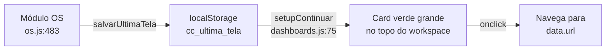

# Análise: Melhoria "Continuar de onde parei"

## 1. Arquivos envolvidos

| Arquivo | Linhas | Função |
|---------|--------|--------|
| [`CRM/pages/dashboard/index.html`](CRM/pages/dashboard/index.html) | 83 | `<button id="continuar-btn">` — elemento HTML atualmente ocupando espaço no workspace |
| [`CRM/pages/dashboard/dashboard.js`](CRM/pages/dashboard/dashboard.js) | 74-90 | `setupContinuar()` — lê `cc_ultima_tela` do localStorage e popula o botão |
| [`CRM/pages/dashboard/dashboard.css`](CRM/pages/dashboard/dashboard.css) | 1-18 | Estilos do `.continuar-btn` — fundo verde, borda, padding 12px 16px, width 100% |
| [`CRM/pages/os/os.js`](CRM/pages/os/os.js) | 481-490 | `salvarUltimaTela()` — **quem escreve** no localStorage (`cc_ultima_tela`) |
| [`CRM/shared/favoritos.js`](CRM/shared/favoritos.js) | 105-168 | Barra de favoritos superior — **local sugerido para o novo botão** |
| [`CRM/shared/dock.js`](CRM/shared/dock.js) | 13-36 | Dock lateral — **alternativa de local** |

## 2. Como funciona hoje



**Fluxo atual:**
1. Usuário navega no módulo OS → `salvarUltimaTela(view, label, sub, hash)` grava no `localStorage`:
   ```json
   {
     "modulo": "os",
     "view": "andamento",
     "label": "OS em Andamento",
     "sub": "OS-0067 → Concluído",
     "hash": "#fav-andamento",
     "url": "/CRM/pages/os/index.html#fav-andamento",
     "ts": 1717000000000
   }
   ```
2. Dashboard carrega → `setupContinuar()` lê do `localStorage` e exibe o botão
3. Usuário clica → `window.location.href = data.url`

## 3. Problema atual

O botão atual ocupa **uma faixa inteira** no topo do workspace:

```
┌─────────────────────────────────────────┐
│  ▶ Continuar de onde parei              │  ← width: 100%, padding: 12px 16px
│     OS-0067 → Concluído                 │     margin-bottom: 16px
└─────────────────────────────────────────┘
┌──────────┐ ┌──────────┐ ┌──────────┐
│   OS     │ │ Alertas  │ │   Meta   │     ← Grid 3x3 empurrado para baixo
└──────────┘ └──────────┘ └──────────┘
```

**Impactos:**
- **Espaço vertical:** ~56px de altura + 16px de margem = **72px** ocupados
- **Peso visual:** Fundo verde `rgba(0,200,83,0.10)` + borda verde + ícone ▶ competem com alertas
- **Baixa densidade:** Mostra apenas 1 atalho, quando poderia mostrar informações operacionais

## 4. Proposta Principal (Recomendada)

**Remover o card verde e adicionar um chip "▶ Continuar" na barra de favoritos superior.**

```
┌──────────────────────────────────────────────────────────────┐
│ 📌 OS em Andamento  ✅ OS Finalizados  👥 Clientes  ▶ Continuar │ ← ccfav-bar
└──────────────────────────────────────────────────────────────┘
┌──────────┐ ┌──────────┐ ┌──────────┐
│   OS     │ │ Alertas  │ │   Meta   │     ← Grid sobe 72px
└──────────┘ └──────────┘ └──────────┘
```

### O que muda

| Item | Antes | Depois |
|------|-------|--------|
| **Local** | Topo do workspace (dentro de `<main>`) | Barra de favoritos (`ccfav-bar`) |
| **Tamanho** | 72px de altura (card inteiro) | ~32px altura (chip inline) |
| **Visibilidade** | Sempre visível quando há dados | Sempre visível quando há dados |
| **Estilo** | Fundo verde, borda, destaque | Chip padrão (`ccfav-chip`) igual aos favoritos |
| **Informação** | Label + destino + sub | Label ▶ Continuar (tooltip com detalhes) |

### Implementação

**a) Remover** do `dashboard/index.html` (linha 83) e `dashboard.css` (linhas 1-18)

**b) Adicionar** em `shared/favoritos.js`:
- Na função que renderiza a `ccfav-bar`, verificar se `cc_ultima_tela` existe no localStorage
- Se existir, adicionar um chip extra: `<span class="ccfav-chip" id="ccfav-continuar">▶ Continuar</span>`
- No clique, navegar para `data.url`

**c) Opcional:** Adicionar tooltip mostrando o label/destino completo

### Vantagens
- ✅ Libera 72px de espaço vertical no workspace
- ✅ Mantém acesso rápido com 1 clique
- ✅ Consistente com o design dos favoritos
- ✅ Baixíssimo impacto de código
- ✅ Fácil de reverter se necessário

### Complexidade: **BAIXA** (~15-20 minutos)

## 5. Alternativa 2 (Dock Lateral)

Adicionar item na dock lateral em [`CRM/shared/dock.js`](CRM/shared/dock.js):

```javascript
// Dentro de buildDockHTML(), entre os itens existentes
data = JSON.parse(localStorage.getItem('cc_ultima_tela') || 'null');
if (data && data.url) {
  html += `<a href="${esc(data.url)}" class="dock-item" data-tooltip="Continuar: ${esc(data.label)}">
    <span class="dock-icon">▶</span>
  </a>`;
}
```

**Problema:** A dock lateral fica na direita e é menos visível que a barra de favoritos. O usuário precisaria desviar o olhar para a direita.

## 6. Comparação

| Critério | Proposta Principal (barra favoritos) | Alternativa 2 (dock lateral) |
|----------|--------------------------------------|------------------------------|
| Visibilidade | ⭐⭐⭐ Alta (topo, centro) | ⭐⭐ Média (lateral direita) |
| Espaço recuperado | 72px | 72px |
| Consistência UI | ⭐⭐⭐ Mesmo estilo dos favoritos | ⭐⭐⭐ Mesmo estilo da dock |
| Complexidade | ⭐ Baixa | ⭐ Baixa |
| Manutenção | ⭐⭐⭐ Centralizada no favoritos.js | ⭐⭐ Espalhado (dock + condicional) |

## 7. Recomendação Técnica Final

**Implementar a Proposta Principal** por 3 motivos:

1. **Espaço:** A barra de favoritos já existe e o chip "▶ Continuar" se encaixa naturalmente como mais um item de navegação rápida.
2. **Visibilidade:** Fica no topo, centro da tela — onde o usuário naturalmente procura atalhos.
3. **Simplicidade:** Apenas 1 arquivo precisa ser alterado (`favoritos.js`), removendo 3 arquivos do legado (HTML, CSS, JS do dashboard).

### Pré-requisitos
- Nenhum. A função `salvarUltimaTela()` em `os.js` já escreve no localStorage corretamente.
- O Dashboard já importa `favoritos.js` via `shared/dock.js`.

### Riscos
- Mínimos. Se o chip não funcionar, o dashboard simplesmente não mostra o atalho — sem impacto em outras funcionalidades.
- O card antigo será removido, mas a lógica de leitura do localStorage permanece portável.
