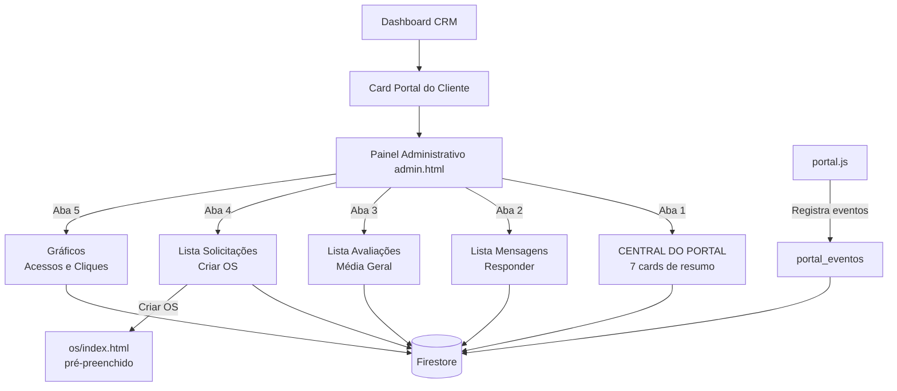

# FASE 2 — PAINEL ADMINISTRATIVO DO PORTAL DO CLIENTE

## Arquitetura Aprovada

```
CRM/pages/portal-cliente/
├── index.html     ← Portal do Cliente (inalterado)
├── portal.js      ← SPA do Cliente (modificado: tracking + horários)
├── portal.css     ← Estilos do Cliente (inalterado)
├── admin.html     ← [NOVO] Painel Administrativo
├── admin.js       ← [NOVO] Lógica do Admin
└── admin.css      ← [NOVO] Estilos do Admin
```

## 1 — Card "Portal do Cliente" no CRM

Modificar [`dashboard.js:1385`](CRM/pages/dashboard/dashboard.js:1385):
```javascript
'portal-cliente': '../../pages/portal-cliente/admin.html'
```

Assim o card abre o **Painel Administrativo** em vez do login do cliente.

## 2 — CENTRAL DO PORTAL (Tela Única de Resumo)

No admin, seção principal exibe:

| Card | Dados |
|------|-------|
| 💬 Mensagens Pendentes | Total de `mensagens_portal` com `lida == false` |
| ⭐ Avaliações Recebidas | Total de `avaliacoes` + média geral |
| 🔧 Solicitações de Orçamento | Total de `solicitacoes_diagnostico` com `status == "pendente"` |
| 👥 Clientes Hoje | Total de `portal_eventos` com `tipo == "acesso"` e data = hoje |
| 🕐 Último Acesso | Nome + data do último `portal_eventos` com `tipo == "acesso"` |
| 💚 Cliques WhatsApp | Total de `portal_eventos` com `tipo == "clique_whatsapp"` |
| 🗺️ Cliques Google Maps | Total de `portal_eventos` com `tipo == "clique_maps"` |

## 3 — Aba "Mensagens"

Lista de `mensagens_portal` com:
- Nome, telefone, mensagem, data
- Status: 🟢 Nova / 🔵 Lida / 🟣 Respondida
- Ações: Marcar como Lida, Responder (modal)

## 4 — Aba "Avaliações"

Lista de `avaliacoes` com:
- Nome, estrelas (★), comentário, data
- Média geral no topo
- Avaliações Google: estrutura preparada para Place ID

## 5 — Aba "Solicitações"

Lista de `solicitacoes_diagnostico` com:
- Nome, telefone, equipamento, modelo, defeito, data
- Botão: **📋 Criar OS** — abre `os/index.html` com parâmetros na URL:
  ```
  os/index.html?nome=NOME&telefone=TELEFONE&equipamento=TIPO&modelo=MODELO&defeito=DEFEITO
  ```

## 6 — Aba "Estatísticas"

Baseado em `portal_eventos`:
- Acessos hoje / semana / mês (gráfico de barras simples)
- Cliente que mais acessou
- Último cliente que acessou
- Cliques WhatsApp / Maps hoje

## 7 — Nova Coleção: `portal_eventos`

```javascript
{
  telefone: "(62) 98160-5863",
  clientName: "João",
  tipo: "acesso" | "clique_whatsapp" | "clique_maps" | "consulta_garantia" | "consulta_os",
  pagina: "painel" | "contato" | "como-chegar" | "garantias" | "os",
  createdAt: serverTimestamp()
}
```

## 8 — Tracking no portal.js

Adicionar em:

| Método | Evento |
|--------|--------|
| `doLogin()` | `tipo: "acesso"` |
| `renderContato()` clique WhatsApp | `tipo: "clique_whatsapp"` |
| `renderComoChegar()` clique Maps | `tipo: "clique_maps"` |
| `renderGarantias()` | `tipo: "consulta_garantia"` |
| `renderOSList()` | `tipo: "consulta_os"` |

## 9 — Corrigir Horários

- Seg–Sex: `09:00–19:00` → **`08:00–18:00`**
- Sáb: `09:00–14:00` → **`08:00–14:00`**

## 10 — Integração Dashboard (CRM)

O Dashboard já possui:
- `gerarAlertas()` monitora `mensagens_portal`, `avaliacoes`, `solicitacoes_diagnostico`
- `portal-badge` no card do Portal
- Pulse animation `module-card-pulse`

## Ordem de Implementação

```
[ ] 1. Corrigir horários no portal.js (renderContato, renderComoChegar)
[ ] 2. Adicionar tracking de eventos no portal.js
[ ] 3. Criar admin.html
[ ] 4. Criar admin.css
[ ] 5. Criar admin.js (PortalAdmin com Dashboard + Mensagens + Avaliações + Solicitações + Estatísticas)
[ ] 6. Modificar dashboard.js rota para admin.html
[ ] 7. Testar integração completa
```

## Mapa de Telas


