# DER Mestre — Cell City (preparação SQL, 2026-07-07)

> Diagrama de navegação de alto nível: as entidades centrais e os relacionamentos que atravessam domínios. Para o detalhe completo de cada domínio (colunas, tipos, CHECK, índices, tabelas-filhas de arrays), ver os arquivos em `sql/schema/*.sql` — este diagrama não repete o que já está no DDL, só situa como as peças se encaixam.
>
> 82 tabelas no total: 54 coleções ativas de `COLECOES_FIRESTORE.md` → 75 tabelas SQL (a diferença são as tabelas-filhas criadas para os campos repetidos/array do Firestore) + 7 tabelas legadas mínimas (`acoes_semana`, `historico_diario/semanal/mensal`, `resumo_live`, `posvenda_rastreamento`, `produtos`) adicionadas na auditoria final de 2026-07-07 para fechar a paridade 1:1 com os 58 repositories da Camada Repository (ver auditoria em `sql/04_auditoria_final.md`). 62 relacionamentos (FK) no total — as 7 tabelas legadas não têm nenhum, por não terem consumidor de código; este diagrama mostra os ~30 relacionamentos que cruzam domínio — o resto (tabela-filha → tabela-mãe dentro do mesmo domínio, ex. `os_fotos → os`) está nos arquivos de schema.

```mermaid
erDiagram
    CLIENTES ||--o{ OS : "possui"
    CLIENTES ||--o{ CRM_LEADS : "gera"
    CLIENTES ||--o{ VENDAS_IMPORTADAS : "compra"

    OS ||--o| PRE_OS : "convertida de"
    OS ||--o| SOLICITACOES_DIAGNOSTICO : "originada de"
    OS ||--o{ POSVENDA_CONTATOS : "gera"
    OS ||--o{ FINANCEIRO_RECEBER : "gera"
    OS ||--o{ ALERTAS_USUARIO : "referencia"
    OS ||--o{ AVALIACOES : "recebe"
    OS ||--o| CRM_LEADS : "convertida de"

    CRM_LEADS ||--o| PRE_OS : "gera"
    CRM_LEADS ||--o{ ALERTAS_USUARIO : "referencia"

    POSVENDA_CONTATOS }o--|| POSVENDA_MENSAGENS : "usa template de"

    USUARIOS }o--|| PERFIS_OPERACIONAIS : "tem"
    USUARIOS ||--o| FAVORITOS_USUARIOS : "tem"
    USUARIOS ||--o| NOTAS_USUARIOS : "tem"
    USUARIOS ||--o| TAREFAS_SEMANA : "tem"
    USUARIOS ||--o| CENTRAL_ALERTAS_STATUS : "tem"
    USUARIOS ||--o| ALARME_CONFIG : "tem"
    USUARIOS ||--o{ USUARIOS_PREFERENCIAS : "tem"
    USUARIOS ||--o{ AUDITORIA_USUARIOS_PERMISSOES : "executa/sofre ação"
    USUARIOS ||--o{ PERFIS_OPERACIONAIS : "cria"

    PERFIS_OPERACIONAIS ||--o{ PERFIS_OPERACIONAIS_PERMISSOES : "define"

    EMPRESAS ||--o{ USUARIOS : "tem"
    EMPRESAS ||--o{ AUDITORIA_SAAS : "gera"
    EMPRESAS ||--o{ NOTIFICACOES_SAAS : "recebe"
    EMPRESAS ||--o{ EMPRESAS_MODULOS_ATIVOS : "libera"

    INFORMACOES |o--o| COMANDOS : "migra para (v1)"
    COMANDOS }o--o| CATEGORIAS_COMANDOS : "categoriza"
    INFORMACOES }o--o| CATEGORIAS_INFORMACOES : "categoriza"

    CATALOGO_PRODUTOS }o--o| CATEGORIAS_PRODUTOS : "categoriza"

    CAIXA_LANCAMENTOS }o--o| CATEGORIAS_CAIXA : "categoriza"
    FINANCEIRO_PAGAR }o--o| FINANCEIRO_CATEGORIAS : "categoriza"
    FINANCEIRO_FIXAS }o--o| FINANCEIRO_CATEGORIAS : "categoriza"

    DIARIO_REGISTROS ||--o{ DIARIO_EVENTOS : "gera histórico"
```

## Leitura do diagrama

- **Hubs reais** (mais conectados): `os`, `usuarios`, `clientes`, `crm_leads`, `empresas`. Isso é esperado — são as mesmas entidades que já concentram a maior parte da lógica de negócio no Firestore hoje (ver `COLECOES_FIRESTORE.md` §22, "Resumo de Relacionamentos").
- **`empresas`/`usuarios.empresa_id`** existe no modelo por completude (o Firestore tem o campo), mas é marcado explicitamente como "single-tenant hoje" — não modelar isso como se fosse uma feature ativa seria perder informação real do domínio, mas o modelo também não força nenhuma regra de isolamento multiempresa que não existe hoje no sistema (ver `sql/00_visao_geral.md` §5 "O que este modelo NÃO assume").
- **`informacoes ↔ comandos`** é o único relacionamento bidirecional do domínio de conhecimento — reflete a migração v1 já existente no código real (`executarMigracao()` em `comandos.js`), não uma invenção da modelagem.
- **Tabelas puramente "folha"** (sem nenhuma FK de saída, só recebidas): `categorias_*`, tabelas de `config`, logs de auditoria. Não aparecem isoladas no diagrama por clareza, mas estão listadas em cada arquivo de domínio.

## Cardinalidades por tipo de relação (contagem)

| Tipo | Quantidade aproximada | Exemplos |
|---|---|---|
| 1:N obrigatória (FK NOT NULL) | 8 | `os_fotos.os_id`, `diario_eventos.registro_id` |
| 1:N opcional (FK nullable) | ~40 | `os.cliente_phone_digits`, `caixa_lancamentos.categoria_id` |
| 1:1 (PK = FK, tabela satélite) | 6 | `favoritos_usuarios`, `notas_usuarios`, `tarefas_semana`, `central_alertas_status`, `alarme_config`, `catalogo_config` |
| 1:1 (FK com UNIQUE, "conversão"/"migração") | 5 | `os.crm_lead_id`, `os.pre_os_id`, `os.solicitacao_id`, `crm_leads.pre_os_id`, `informacoes.migracao_destino_id` (+ `comandos.migrado_de`, mesmo par). **Corrigido na auditoria final de 2026-07-07**: a `UNIQUE` estava faltando nessas colunas (FK sem `UNIQUE` só garantiria N:1, não o 1:1 que o próprio diagrama já declarava) — ver `sql/04_auditoria_final.md` |
| N:M | 0 | Nenhuma relação N:M verdadeira foi encontrada nos dados atuais — o mais próximo (`perfis_operacionais` × módulos) já é modelado como tabela de associação (`perfis_operacionais_permissoes`), não uma N:M pura, porque carrega atributos próprios (visualizar/criar/editar/excluir/aprovar) |
